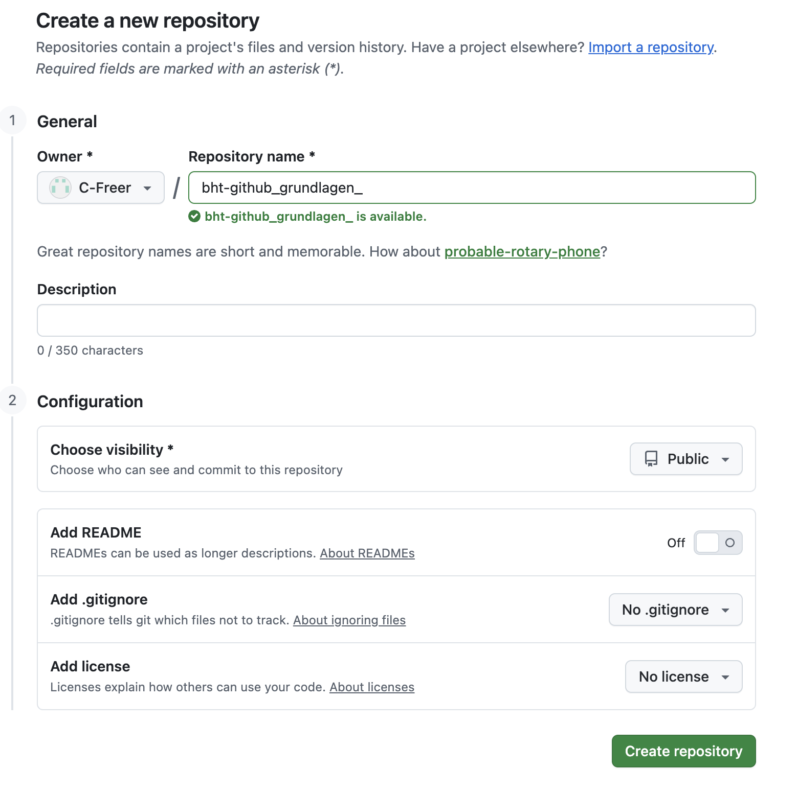
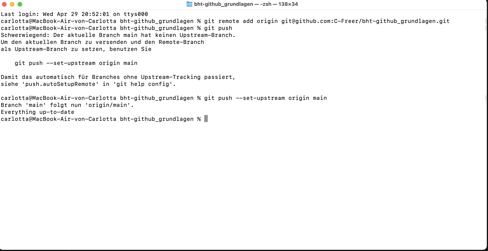
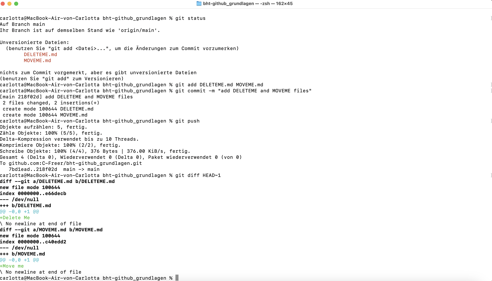
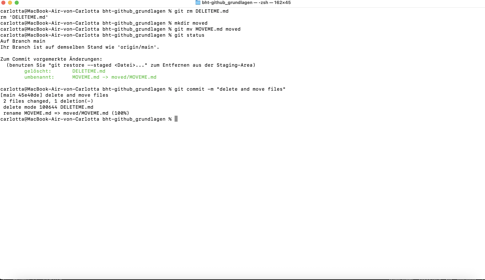
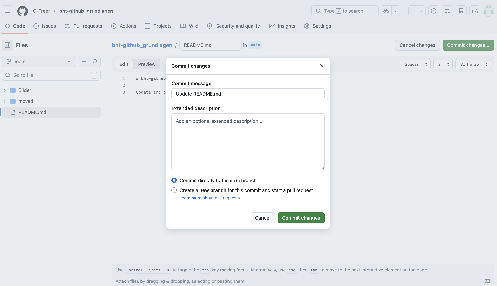
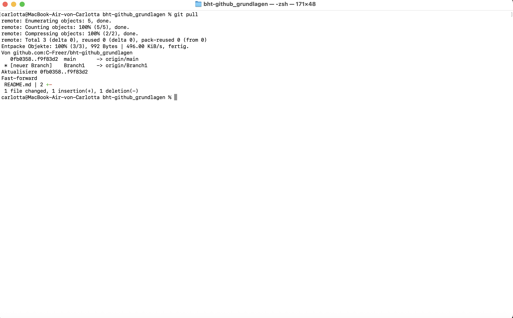
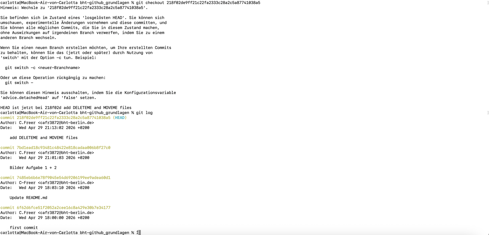
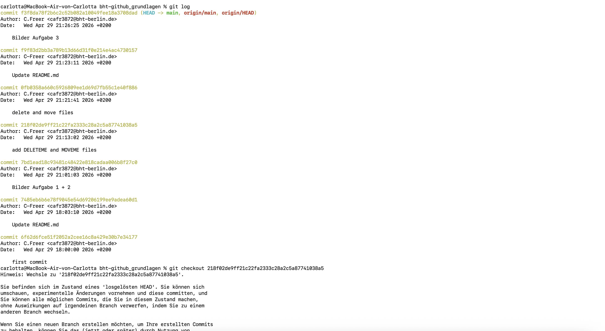
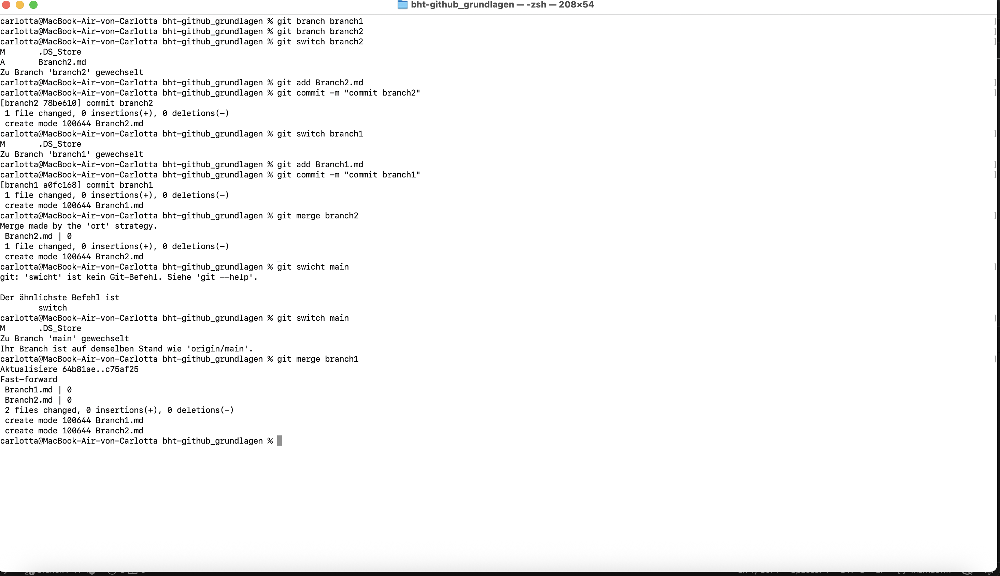
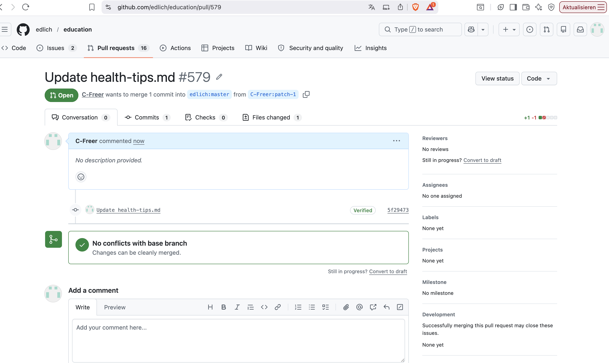

# bht-github_grundlagen

Dieses Repository enthält die Lösungen und Screenshots zu den Git-Grundlagenaufgaben.

---

## Aufgabe 1

---

## Aufgabe 2

---

## Aufgabe 3

### Part 1

### Part 2

### Part 3

### Part 4

---

## Aufgabe 4

### Part 1

### Part 2

---

## Aufgabe 5

---

## Aufgabe 6
